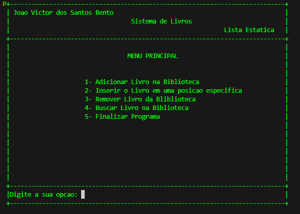

# Sistema de Livros

**[SistemaLivros.c](SistemaDeLivros.c)**

## Interface
A interface visual do sistema é criada com a função `gotoxy`, responsável por posicionar o cursor do console em coordenadas específicas. Com isso, elementos como títulos, bordas e mensagens podem ser exibidos em locais determinados da tela.  

A função `tela` desenha a estrutura principal do sistema, exibindo o nome do desenvolvedor, o título do sistema, o tipo de lista utilizada e uma área reservada para mensagens. 

`````c
void gotoxy(int x, int y){
    COORD coord;
    coord.X = (short) x;
    coord.Y = (short) y;
    SetConsoleCursorPosition(GetStdHandle(STD_OUTPUT_HANDLE), coord);
}

void tela(){
    int i, c;

    for(i=1;i<=24;i++){
        gotoxy(1,i);   printf("|");
        gotoxy(79,i);  printf("|");
    }

    for(c=2;c<=78;c++){
        gotoxy(c,1);   printf("-");
        gotoxy(c,5);   printf("-");
        gotoxy(c,22);  printf("-");
        gotoxy(c,24);  printf("-");
    }

    gotoxy(1,1);   printf("+");   gotoxy(79,1);  printf("+");
    gotoxy(1,5);   printf("+");   gotoxy(79,5);  printf("+");
    gotoxy(1,22);  printf("+");   gotoxy(79,22); printf("+");
    gotoxy(1,24);  printf("+");   gotoxy(79,24); printf("+");

    gotoxy(3,2);  printf("Joao Victor dos Santos Bento");
    gotoxy(36,3);  printf("Sistema de Livros");
    gotoxy(62,4); printf("Lista Estatica");

    gotoxy(2, 23);
    printf("MSG:");
}
`````

Exemplo da tela visual:



## Estrutura de Dados

Para armazenar os livros, inicialmente foi definida a constante ``MAX`` com valor 5, que representa o tamanho máximo da lista. Cada livro é representado pela struct ``reg_livros``, contendo os campos ``id``, ``titulo``, ``autor`` e ``ano``.

A struct Lista agrupa os registros de livros em um vetor fixo de tamanho ``MAX`` e mantém o controle dos índices inicio e fim, utilizados para gerenciar a inserção e remoção dos elementos.

`````c

#define MAX 5

typedef struct{
    int id;
    char titulo[50];
    char autor[30];
    char ano[30];
}reg_livros;

typedef struct{
    int inicio;
    int fim;
    reg_livros liv[MAX];
}Lista;

`````

## Menu Principal

A função main contém o menu principal, exibido com a função ``tela()`` e posicionado com ``gotoxy``. O usuário pode escolher entre adicionar livros, inserir em posições específicas, remover, buscar ou finalizar o programa.

`````c
    Lista l;
    int opcao=0;
    l.inicio=0;
    l.fim=0;

    tela();
    system("color 02");

    do {

        gotoxy(35,7);
        printf("MENU PRINCIPAL");

        gotoxy(23,10);
        printf("1- Adicionar Livro na Biblioteca");
        gotoxy(23,11);
        printf("2- Inserir o Livro em uma posicao especifica");
        gotoxy(23,12);
        printf("3- Remover Livro da Bliblioteca");
        gotoxy(23,13);
        printf("4- Buscar Livro na Biblioteca");
        gotoxy(23,14);
        printf("5- Finalizar Programa");

        limpa_MSG();
        gotoxy(2,23);
        printf("Digite a sua opcao: ");
        scanf("%d", &opcao); 
        
        switch(opcao){
            case 1:
                adicionarLivro(&l);
                break;
            case 2:
                inserirPosicao(&l);
                break;
            case 3:
                removerLivro(&l);
                break;
            case 4:
                buscarLivro(&l);
                break;
            case 5:
                break;
            default:
                system("cls");
                tela();

                gotoxy(7,23);
                printf("Nenhuma opcao valida foi inserida......");
                break;
        }

    } while(opcao >= 1 && opcao <= 4);


    return 0;
`````

## Funções do Sistema
#### 1. Adicionar Livro

Insere novos registros no final da lista. Verifica se a lista está cheia, coleta os dados do usuário e atualiza o contador fim..


`````c

void adicionarLivro(Lista *l){
    reg_livros liv;
    int opcao=0;

    do {
        if(l->fim >= MAX){
            system("cls");
            tela();

            limpa_MSG();
            gotoxy(2,23);
            printf("A sua lista esta cheia");

            getch();

            system("cls");
            tela();
            printf("Pressione qualquer tecla para voltar ao menu principal.....");

            getch();

            return;
        } else {

            system("cls");
            tela();
            tela_livro();

            gotoxy(32, 6);
            printf("ADICIONANDO LIVRO");

            gotoxy(43,10);
            scanf("%d", &liv.id);

            gotoxy(43,12);
            fflush(stdin);
            fgets(liv.titulo, 50, stdin);

            gotoxy(43,14);
            fflush(stdin);
            fgets(liv.autor, 30, stdin);

            gotoxy(43,16);
            fflush(stdin);
            fgets(liv.ano, 50, stdin);

            }

            l->liv[l->fim] = liv;
            l->fim++;

            limpa_MSG();
            gotoxy(2,23);
            printf("O livro foi cadastrado com sucesso!!!");

            getch();

            system("cls");
            tela();
           
            limpa_MSG();
            gotoxy(2,23);
            printf("Deseja inserir outro(1-Sim, 2-Nao): ");
            scanf("%d", &opcao);

    } while(opcao != 2);

    system("cls");
    tela();
    return;
}
`````

#### 2. Inserir em Posição Específica

Permite adicionar um livro em uma posição escolhida, deslocando os elementos existentes para abrir espaço. Valida se a posição é válida e se a lista não está vazia.

`````c
void inserirPosicao(Lista *l){
    
    reg_livros liv;
    int i;
    int posicao=0;
    int verificacao=0;

    if(l->fim == l->inicio){
        
        system("cls");
        tela();

        gotoxy(7,23);
        printf("A sua biblioteca esta vazia, pode adicionar um livro de forma manual");

        getch();

        limpa_MSG();
        gotoxy(2,23);
        printf("Pressione qualquer tecla para voltar ao menu....");

        getch();
        system("cls");
        tela();
        return;

    }

    system("cls");
    tela();
    limpa_MSG();

    do {

        limpa_MSG();
        gotoxy(2,23);
        printf("Digite a posicao em que deseja inserir o livro: ");
        scanf("%d", &posicao);

        system("cls");
        tela();

        limpa_MSG();
        gotoxy(2,23);
        printf("Tem certeza que vai ser essa posicao(1-Sim, 2-Nao): ");
        scanf("%d", &verificacao);
    
    } while(verificacao != 1);

    if(posicao < 0 || posicao > l->fim){
        limpa_MSG();
        gotoxy(2,23);
        printf("Posicao invalida");
        return;
    }

    for(i=l->fim;i>posicao;i--){
        l->liv[i] = l->liv[i-1];

    }

    system("cls");
    tela();
    tela_livro();

    gotoxy(25,6);
    printf("CADASTRANDO O LIVRO DESEJADO NA POSICAO %d ", posicao);

    gotoxy(43,10);
    scanf("%d", &liv.id);

    gotoxy(43,12);
    fflush(stdin);
    fgets(liv.titulo, 50, stdin);

    gotoxy(43,14);
    fflush(stdin);
    fgets(liv.autor, 30, stdin);

    gotoxy(43,16);
    fflush(stdin);
    fgets(liv.ano, 50, stdin);

    l->liv[posicao] = liv;
    l->fim++;

    system("cls");
    tela();

    limpa_MSG();
    gotoxy(2,23);
    printf("O livro foi cadastrado com sucesso!!!");

    getch();
    system("cls");
    tela();

    limpa_MSG();
    gotoxy(2,23);
    printf("Pressione qualquer tecla para voltar ao menu principal.....");

    getch();
    return;

}
`````

#### 3. Remover Livro

Exclui um livro pelo seu ID. Após localizar a posição do livro na lista, o sistema pede confirmação, remove o registro e atualiza o índice fim.

`````c
void removerLivro(Lista *l){
    
    int codigo;
    int i;
    int posicao=0;
    int opcao=0;
    int continuar=0;

    
    do {

        system("cls");
        tela();

        gotoxy(32,6);
        printf("REMOVENDO LIVRO");

        limpa_MSG();
        gotoxy(2,23);
        printf("Digite o ID do livro que deseja remover: ");
        scanf("%d", &codigo);

        posicao = pesquisa(codigo, l);

        if(posicao == -1){

            system("cls");
            tela();

            limpa_MSG();
            gotoxy(2,23);
            printf("O ID do livro nao foi encontrado...");

            getch();
            system("cls");
            tela();

            limpa_MSG();
            gotoxy(2,23);
            printf("Pressione qualquer tecla para voltar ao menu principal");

            getch();
            return;
        }

        system("cls");
        tela();
        tela_livro();

        gotoxy(25,6);
        printf("EXCLUINDO LIVRO %s", l->liv[posicao].titulo);

        gotoxy(43,10);
        printf("%d", l->liv[posicao].id);

        gotoxy(43,12);
        printf("%s", l->liv[posicao].titulo);

        gotoxy(43,14);
        printf("%s", l->liv[posicao].autor);

        gotoxy(43,16);
        printf("%s", l->liv[posicao].ano);

        limpa_MSG();
        gotoxy(2,23);
        printf("Tem certeza que deseja excluir esse livro? (1-Sim, 2-Nao): ");
        scanf("%d", &opcao);

        if(opcao == 1){

            for(i = posicao; i < l->fim - 1; i++){
                l->liv[i] = l->liv[i+1];
            }
            l->fim--;

            system("cls");
            tela();

            gotoxy(2,23);
            printf("O Livro foi excluido com sucesso....");

            getch();

        } else {

            system("cls");
            tela();

            gotoxy(7,23);
            printf("A exclusao foi cancelada.....");

            getch();

        }

        system("cls");
        tela();

        limpa_MSG();
        gotoxy(2,23);
        printf("Deseja remover outro livro(1-Sim, 2-Nao)? ");
        scanf("%d", &continuar);

    } while(continuar != 2);

    system("cls");
    tela();

    limpa_MSG();
    gotoxy(2,23);
    printf("Pressione qualquqer tecla para voltar ao menu principal....");

    getch();
    return;
}
`````

#### 4. Buscar Livro

Consulta um livro pelo ID, exibindo suas informações de forma organizada. Utiliza a função auxiliar pesquisa para localizar a posição do livro no vetor.

`````c

int pesquisa(int codigo, Lista *l){
    int i;
    
    for(i=l->inicio;i < l->fim;i++){
        if(codigo == l->liv[i].id){
            return i;
        }
    }
    return -1;
}

void buscarLivro(Lista *l){
    
    int codigo;
    int posicao=0;
    int continuar=0;

    do {
        system("cls");
        tela();

        limpa_MSG();
        gotoxy(2,23);
        printf("Digite o ID do livro que deseja consultar: ");
        scanf("%d", &codigo);

        posicao = pesquisa(codigo, l);

        
        if(posicao != -1){
            
            system("cls");
            tela();
            tela_livro();

            gotoxy(32,6);
            printf("CONSULTA LIVRO %d ", l->liv[posicao].id);

            gotoxy(43,10);
            printf("%d", l->liv[posicao].id);

            gotoxy(43,12);
            printf("%s", l->liv[posicao].titulo);

            gotoxy(43,14);
            printf("%s", l->liv[posicao].autor);

            gotoxy(43,16);
            printf("%s", l->liv[posicao].ano);

            gotoxy(7,23);
            printf("Realizando Consulta");

            getch();


        } else {
            system("cls");
            tela();

            limpa_MSG();
            gotoxy(2,23);
            printf("ID do livro nao foi encontrada, tente novamente....");

            getch();
            system("cls");
            tela();

            limpa_MSG();
            gotoxy(2,23);
            printf("Pressione qualquer tecla para continuar....");

            getch();
            return;
        }

        system("cls");
        tela();

        limpa_MSG();
        gotoxy(2,23);
        printf("Deseja realizar outra consulta(1-Sim, 2-Nao): ");
        scanf("%d", &continuar);

    } while(continuar != 2);

}
``````

## Como Executar

1. Compile o projeto usando um compilador C (GCC, Visual Studio, etc.).

2. Execute o programa no console.

3. Interaja com o menu principal para adicionar, remover ou consultar livros.